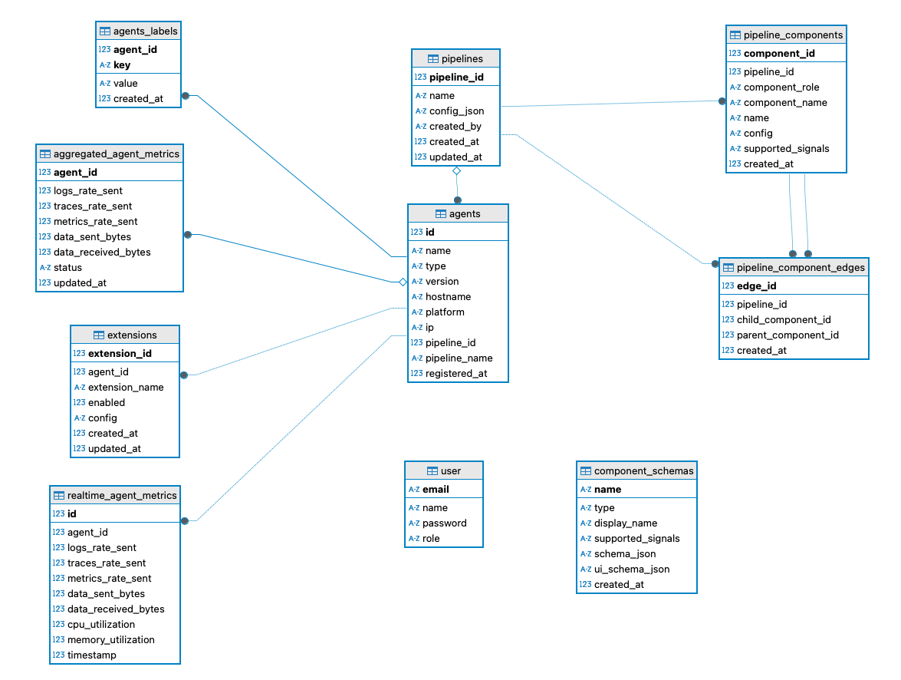

# 🏗️ CTRLTower Architecture

This document explains the high-level design and internal components of **CTRLTower**, the telemetry agent control plane built by **CTRLB**.

---

## 📚 Overview

CTRLTower is designed to manage distributed telemetry agents (specifically OpenTelemetry Collector instances) across a variety of environments. It includes:

- A **Control Plane** (frontend + backend)
- A **Lightweight Agent** installed on target environments
- **Configuration & Communication Layers** that bind them together

---

## 🧹 Core Components

### 1. Frontend

- Built in **React** + **Vite**
- Visual interface for managing agent and pipeline configurations
- Supports start, stop, and shutdown of agents directly from the UI
- Displays metrics such as:
  - CPU and memory utilization of each agent
  - Rate of logs, traces, and metrics flowing through the agent
- Communicates with the backend via REST APIs

### 2. Backend

- Written in **Go**
- Manages:
  - Agent/Pipeline registration and status
  - Config delivery over HTTP (push model)
  - Conversion of graph-based config from frontend into agent-compatible format
  - Background process that scrapes Prometheus metrics exposed by agents and stores them in DB
- API endpoints are documented [`here`](../backend/api-reference.md)
- Stores metadata in **SQLite** (swappable with other SQL DBs)

### 3. Agent

- A wrapper around the **OpenTelemetry Collector**
- Responsibilities:
  - Poll backend to inform it that the config file has changed and fetch updated configurations
  - Send heartbeat/status info in Prometheus exposition format
  - Launch or reload OTel collector with new config

---

## 🔄 Communication Flow

1. **Agent Bootstraps**:

   - Agent starts and contacts the backend via `/api/agent/v1/agents`, sending metadata like platform, hostname, version, etc.
   - Backend registers the agent and responds with the latest configuration.

2. **Heartbeat & Metrics**:

   - Backend scrapes the Prometheus metrics exposed by the agent on a periodic basis.
   - Health information and operational metrics are stored in database.

3. **Config Change Notification**:

   - Agent watches its config file and notifies the backend if it detects a change.
   - Backend returns the updated configuration, which the agent writes to its local config file before reloading the collector.&#x20;
   - Agent reloads the OpenTelemetry Collector with the new config.

4. **User Interaction via UI**:

   - Users manage configurations and monitor agents through the frontend.
   - When a user updates a config, the backend persists the change and queues it for delivery to relevant agents.

---

---

## 🔐 Security (WIP)

- Token-based auth for agent registration
- User-level RBAC on the frontend/backend

---

## 📈 Scalability Notes

CTRLTower was initially designed for small-scale systems with around 40–50 agents and pipelines, with simplicity as the guiding principle.

Planned improvements for scalability:
-   Stateless backend (backed by external DB)
-   Agent polling is lightweight and time-interval based
-   Config push model in roadmap
-   Scaling architecture to support 1,000+ agents/pipelines in upcoming iterations

---

## 🧱 Diagrams

*Entity-Relationship Diagram of CTRLTower's internal database schema*

---

## 🚓️ Roadmap (Architecture)

- Support for multiple tenants/workspaces
- Cloud-native deployment (Helm, Terraform modules)
- Plugin system for other agent types
- Agent auto-upgrade and signature validation

